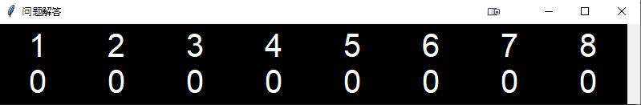
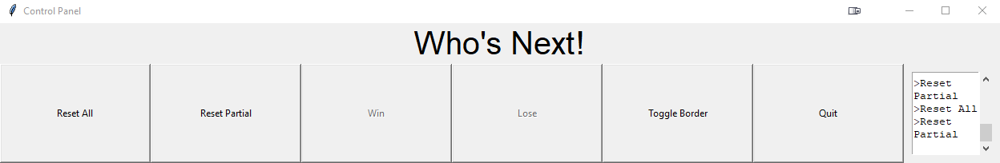
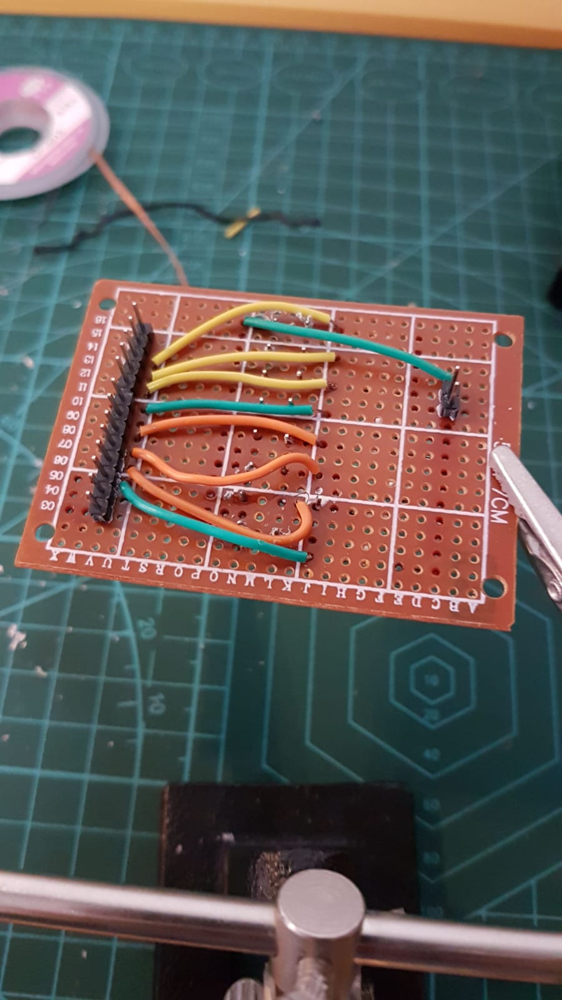
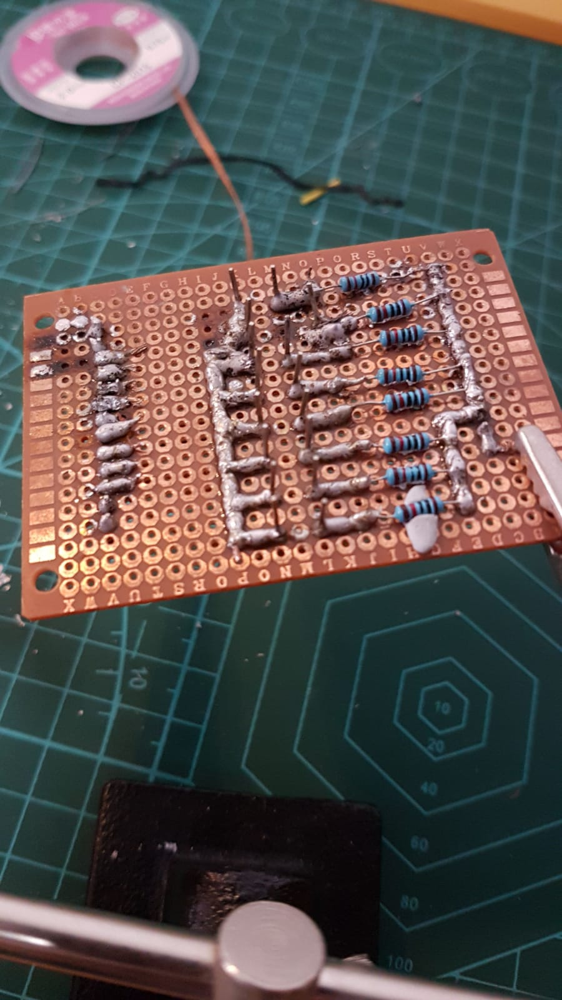

# ProjectBuzzer

This is a hardware project where 8 buttons are setup with an Arduino to play a game similar to 'Game Show'.

### Audience Display

The UI shown is an integrated borderless python tkinter window that can be put over any windows program to show the players and their scores.

### Game Controls

There will be a master control UI to show the configuration and game controls to manipulate the flow of the game.

### Hardwares
> 8 Big Dome Buttons from SparkFun

> Wired Connectors from Arduino to the connectors

#### Self-Soldered Logic Boards

Circuit Front             |  Circuit Back
:-------------------------:|:-------------------------:
  |  
